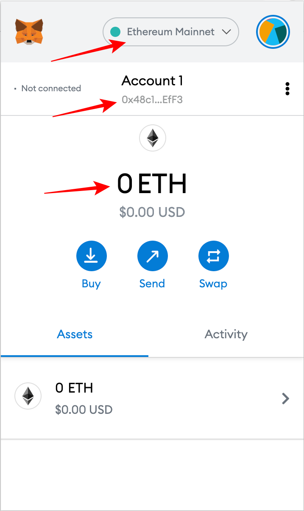
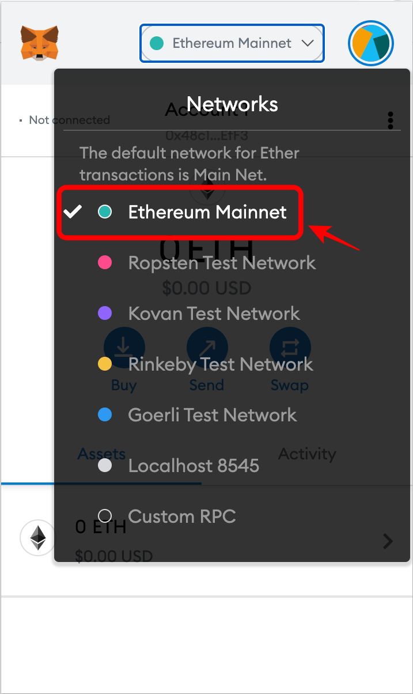
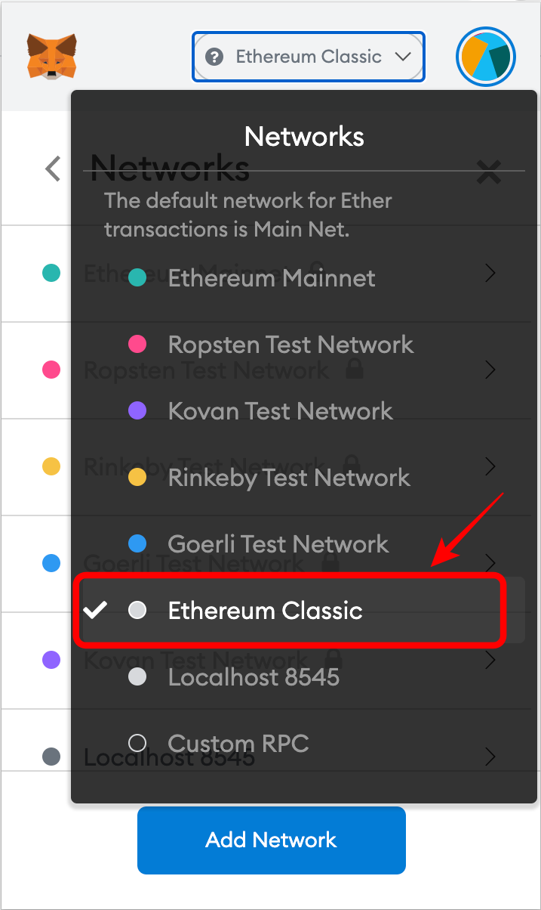

**⚠️ Actualización**  
Ahora puede añadir fácilmente ETC a MetaMask haciendo clic en "Connect-Wallet" en https://chainlist.org/en/chain/61

También puede encontrar este enlace en la parte inferior de cada página de este sitio web.

---

[MetaMask](https://metamask.io) puede utilizarse como cartera para gestionar tus ETC y Tokens, así como para interactuar con las aplicaciones que lo soportan. Este post explica cómo empezar a utilizar MetaMask con la red Ethereum Classic (ETC).

También puede considerar [Nifty Wallet](https://chrome.google.com/webstore/detail/nifty-wallet/jbdaocneiiinmjbjlgalhcelgbejmnid?ucbcb=1), un fork de MetaMask que soporta ETC fuera de la caja.

## Paso 1: Entrar en MetaMask

El primer paso es iniciar la sesión para desbloquear tu MetaMáscara.

## Paso 2: Ver la pantalla inicial

Verás la pantalla inicial normal. En este caso la red por defecto es Ethereum (ETH) y su cuenta se mostrará como siempre. A medida que vayas utilizando otras redes, se mostrarán como las predeterminadas cuando desbloquees tu MetaMask si fueron las últimas que utilizaste.

En mi caso, muestra Ethereum como la red inicial, y tengo un saldo cero en mi cuenta de ETH `0x48c1...EfF3`.

## Paso 3: Abrir el menú desplegable de redes

El siguiente paso es abrir el menú desplegable de redes. Para ello, haga clic en la barra en la que aparece la red por defecto.

Como se puede ver arriba, la lista de redes por defecto es la red principal de Ethereum y sus redes de prueba más populares.

El "Local Host 8545" sería una conexión a un nodo de Ethereum si estuvieras ejecutando uno en tu máquina.

"Custom RPC" es la opción para añadir redes personalizadas, en este caso ETC.

"RPC" significa "remote procedure call" (llamada a procedimiento remoto), que es el término para el protocolo que utilizan las máquinas para que los programas llamen a otros programas en máquinas remotas.

## Paso 4: Seleccionar la RPC personalizada

Así, el siguiente paso es hacer clic en "Custom RPC".

## Paso 5: Ver el formulario de la nueva red

Después de seleccionar "Custom RPC" verá el formulario para añadir una red. Tiene un mensaje de seguridad en la parte superior y cinco opciones con campos vacíos para introducir la nueva red que quieres utilizar:

- Nombre de la red: El nombre de la red que quiere añadir.
- Nueva URL RPC: Una URL para la RPC de red que quieres añadir.
- ID de la cadena: El ID para enviar y dirigir las transacciones a la red que quieres añadir.
- Símbolo de moneda (opcional): El símbolo de la moneda de la red que quieres añadir. Por ejemplo, "ETH" es el símbolo de Ethereum, y "ETC" es el símbolo de Ethereum Classic.
- URL del explorador de bloques (opcional): MetaMask tiene enlaces a exploradores de blockchain por red para comprobar el historial de cuentas, las nuevas transacciones enviadas y los saldos en ellas, por lo que aquí añadirías un explorador de bloques para la red que quieras añadir.

## Paso 6: Introducir la información de la red Ethereum Classic

El siguiente paso es añadir la información específica de Ethereum Classic. A continuación se muestran los datos de la red que he utilizado:

- Nombre de la red: `Ethereum Classic`
- Nueva URL RPC: `https://www.ethercluster.com/etc`
- Cadena ID: `61`
- Símbolo de moneda (opcional): `ETC`
- Bloquear la URL del explorador (opcional): `https://blockscout.com/etc/mainnet/`

Para la "URL RPC" utilicé la proporcionada para este propósito por la Cooperativa ETC

_[Nota del editor] Ethercluster es ahora operado por [RIVET](https://rivet.cloud/). Puede encontrar más puntos finales RPC en la sección [network](/network/endpoints) ._

El "ID de la cadena" debe ser "61" porque ese es el ID específico de la red Ethereum Classic para el envío de transacciones ETC por parte de los monederos y nodos a la blockchain operativa.

Aunque el "símbolo" y la "URL del explorador de bloques" son opcionales, recomiendo utilizar "ETC" como símbolo porque es el símbolo de mercado ampliamente conocido de la red, y BlockScout como explorador de blockchain porque es el que suelo utilizar (¡pero puedes añadir el que prefieras!).

Haz clic en "guardar" para añadir el ETC a MetaMask.

## Paso 7: Ver Ethereum Classic en el menú desplegable de redes

Una vez añadido el ETC, verás en el menú desplegable de redes que se añade a la lista de redes.

## Paso 8: Puede ver su misma cuenta pero en ETC

Si vas a tu cuenta, te darás cuenta de que es la misma que la de ETH. En mi caso, es el mismo `0x48c1...EfF3` cuenta.

Esto se debe a que tanto ETH como ETC utilizan el mismo formato de cuenta, por lo que las cuentas en Ethereum también pueden utilizarse en Ethereum Classic.

De hecho, puede que recuerdes que tenía un saldo cero en mi cuenta de ETH, pero ahora se puede ver un saldo de 1 ETC en la misma cuenta, pero en Ethereum Classic. Esto se debe a que envié 1 ETC a esta cuenta en la red Ethereum Classic para esta demostración.

Observe también que la red ETC es ahora la que aparece en la barra de redes, y el símbolo "ETC" se utiliza ahora para mostrar el saldo.

## Paso 9: Puede volver a Ethereum con la misma cuenta

Así que, como ambas redes utilizan el mismo formato de cuenta, puedes volver a la mainnet de Ethereum y podrás ver tu cuenta de ETH con el mismo número de nuevo.

## Paso 10: Puedes volver a Ethereum Classic con la misma cuenta

Para utilizar la red ETC, simplemente seleccione de nuevo Ethereum Classic en el menú desplegable de redes, donde volverá a ver sus saldos ETC.

//

Le deseo que tenga éxito invirtiendo y utilizando el ETC.

---

** El código es la ley **
