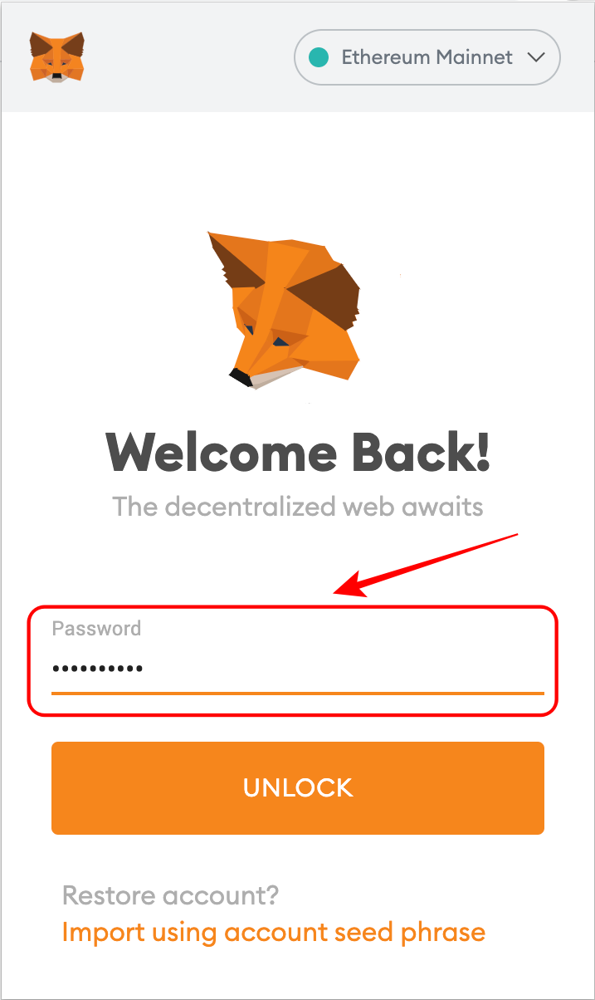
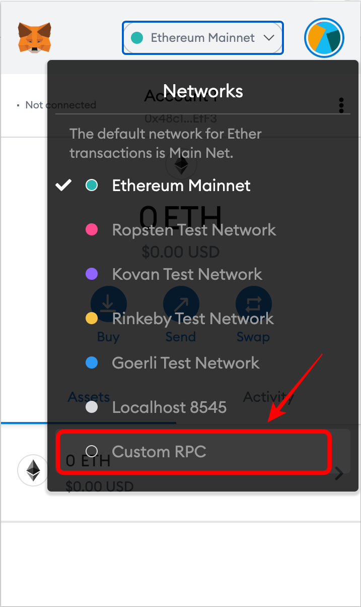
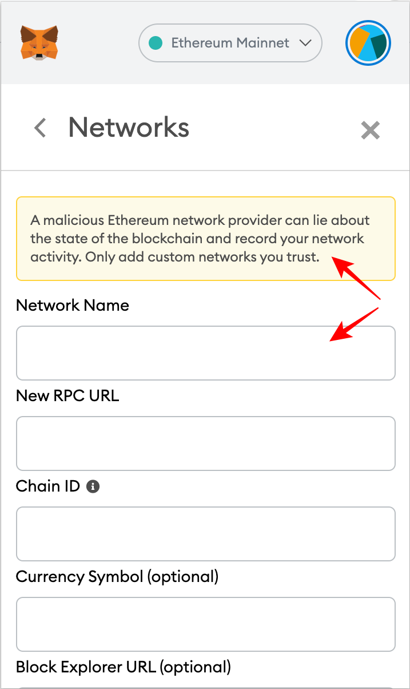
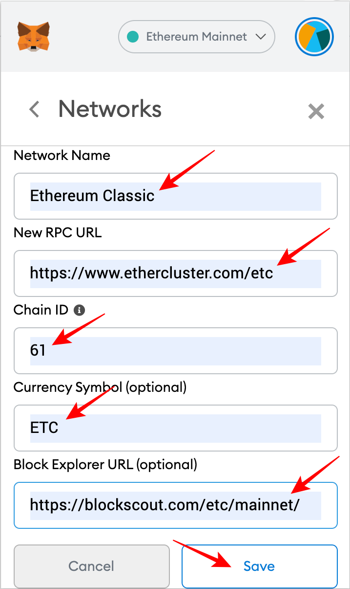
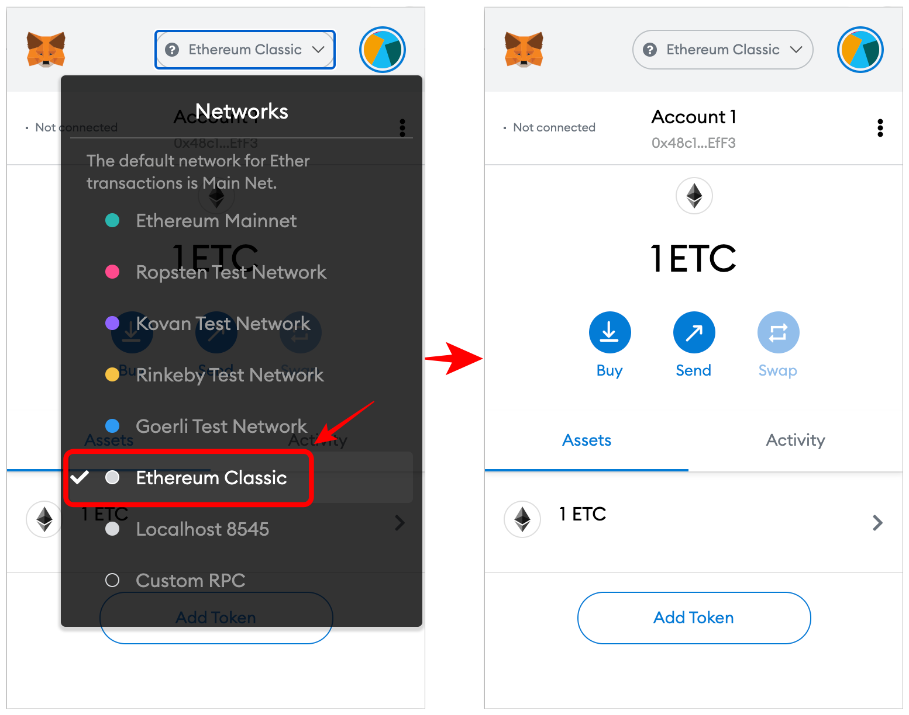

**⚠️アップデート**  
https://chainlist.org/en/chain/61 の「Connect-Wallet」をクリックすることで、MetaMaskにETCを簡単に追加できるようになりました。

また、本サイトの各ページの最下部にもこのリンクがあります。

---

[MetaMask](https://metamask.io) は、ETCやトークンを管理するウォレットとして利用できるほか、対応するアプリケーションとのやり取りも可能です。 この記事では、Ethereum Classic（ETC）ネットワークでMetaMaskの利用を開始する方法を説明します。

また、 [Nifty Wallet](https://chrome.google.com/webstore/detail/nifty-wallet/jbdaocneiiinmjbjlgalhcelgbejmnid?ucbcb=1)は MetaMask のフォークで、ETC をすぐにサポートします。

## 1. MetaMaskにログインする

まず、ログインしてMetaMaskのロックを解除します。

## 2. 初期画面を見る

通常の初期画面が表示されます。 この場合、デフォルトのネットワークはイーサリアム（ETH）であり、アカウントは通常通り表示されます。 他のネットワークを利用した場合、最後に利用したネットワークであれば、MetaMaskのロック解除時にデフォルトとして表示されます。

私の場合、初期ネットワークとしてEthereumが表示され、ETH口座の残高がゼロになりました `0x48c1...EfF3`.

## 3. Networks ドロップダウンメニューを開く

次に、ネットワークのドロップダウンメニューを開きます。 デフォルトのネットワークが表示されているバーをクリックすると、これを行うことができます。

上で見たように、デフォルトのネットワークリストは、Ethereumメインネットとその最も人気のあるテストネットです。

ローカルホスト8545」は、あなたのマシンでイーサリアムノードが稼働していれば、そのノードへの接続となる。

"カスタムRPC "は、カスタムネットワークを追加するオプションで、今回はETCを追加しました。

「RPCとは "リモートプロシージャコール "の略で、マシンが遠隔地にある他のプログラムを呼び出すためのプロトコルを指す言葉である。

## 4. カスタムRPCを選択

そこで、次に「カスタムRPC」をクリックします。

## 5. 新しいネットワークフォームを見る

カスタムRPC」を選択すると、ネットワークを追加するためのフォームが表示されます。 上部にセキュリティメッセージが表示され、使用したい新しいネットワークを入力するための空欄のある5つのオプションがあります。

- 追加するネットワークの名前です。
- 新しいRPCのURL。 追加するネットワークRPCのURLです。
- チェーンID：追加したいネットワークにトランザクションを送信し、指示するためのIDです。
- Currency Symbol（オプション）。 追加するネットワークの通貨記号です。 例えば、「ETH」はイーサリアムのシンボル、「ETC」はイーサリアムクラシックのシンボルです。
- ブロックエクスプローラーのURL（任意）。 MetaMaskはネットワークごとにブロックチェーンエクスプローラーへのリンクがあり、アカウント履歴や新規取引送信、残高などを確認することができますので、ここでは追加したいネットワークのブロックエクスプローラーを追加することになります。

## 6. Ethereum Classicのネットワーク情報を入力します。

次に、Ethereum Classicの固有の情報を追加します。 以下は、使用したネットワークデータです。

- ネットワーク名 `イーサリアムクラシック`
- 新しいRPCのURL： `https://www.ethercluster.com/etc`
- チェーン ID： `61`
- 通貨記号（オプション）。 `ETC`
- ブロックエクスプローラーURL（オプション）： `https://blockscout.com/etc/mainnet/`

RPC URL」については、この目的のために [ETC Cooperative](https://etccooperative.org/)が提供するものを使いました。 これは、彼らが構築した [Ethercluster](https://ethercluster.com/)という製品に由来するものです。

_[編集部注】Etherclusterは現在， [RIVET](https://rivet.cloud/)によって運営されています。 その他のRPCエンドポイントは、 [network](/network/endpoints) セクションに掲載されています。_

チェーンID」は、ウォレットやノードによるETC取引を運用中のブロックチェーンに送信するためのイーサリアムクラシックネットワークの固有IDであるため、「61」でなければなりません。

シンボル」と「ブロックエクスプローラーURL」は任意ですが、シンボルはネットワークのマーケットシンボルとして広く知られている「ETC」、ブロックチェーンエクスプローラーは私が普段使っている「BlockScout」がおすすめです（ただし、お好みのものを追加することも可能です！

保存」をクリックすると、ETCがMetaMaskに追加されます。

## 7. ネットワーク・ドロップダウン・メニューでEthereum Classicを表示する

ETCが追加されると、ネットワークのドロップダウンメニューで、ネットワークのリストに追加されたことが確認できます。

## 8. 同じアカウントをETCで見ることができます。

アカウントにアクセスすると、ETHのアカウントと同じであることがわかります。 私の場合、同じ `0x48c1...EfF3` のアカウントになります。

これは、ETHとETCが同じ口座形式を採用しているため、イーサリアムの口座がイーサリアムクラシックでも使用できる可能性があるためです。

実際、ETHの口座の残高がゼロだったのを覚えている人もいるかもしれないが、今は同じ口座でもイーサリアムクラシックで1ETCの残高が見られることがある。 これは、今回のデモのために、イーサリアムクラシックネットワークのこのアカウントに1ETCを送ったからです。

また、ネットワークバーに表示されるネットワークはETCネットワークになり、残高の表示には「ETC」のマークが使われるようになりましたので、ご注意ください。

## 9. 同じアカウントでイーサリアムに戻ることができます。

そのため、両方のネットワークが同じアカウント形式を使用しているため、イーサリアムのメインネットに戻ると、再び同じ番号のETHアカウントを見ることができるようになります。

## 10. 同じアカウントでイーサリアムクラシックに戻ることができます。

ETCネットワークを使用するには、ネットワークのドロップダウンメニューでイーサリアムクラシックを再度選択するだけで、ETCの残高が再度表示されます。

//

ETCへの投資や利用が成功することを祈っています。

---

** 規範は法律である **
