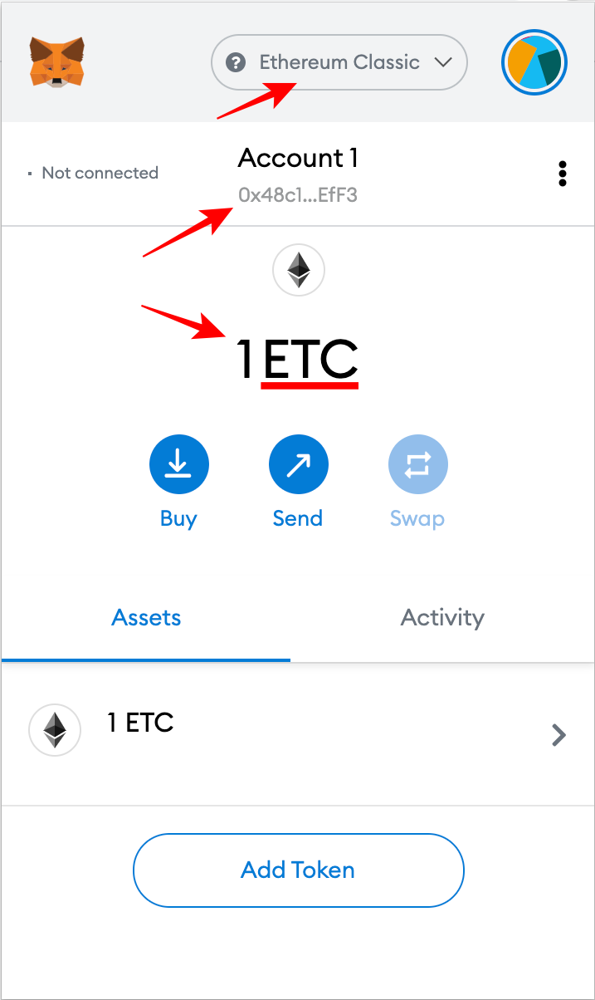

**⚠️ Kemas kini**  
Anda kini boleh menambah ETC ke MetaMask dengan mudah dengan mengklik "Connect-Wallet" di https://chainlist.org/en/chain/61

Anda juga boleh mencari pautan ini di bahagian bawah setiap halaman di laman web ini.

---

[MetaMask](https://metamask.io) boleh digunakan sebagai dompet untuk mengurus ETC dan Token anda, serta berinteraksi dengan aplikasi yang menyokongnya. Siaran ini menerangkan cara mula menggunakan MetaMask dengan rangkaian Ethereum Classic (ETC).

Anda juga boleh mempertimbangkan [Nifty Wallet](https://chrome.google.com/webstore/detail/nifty-wallet/jbdaocneiiinmjbjlgalhcelgbejmnid?ucbcb=1), garpu MetaMask yang menyokong ETC di luar kotak.

## Langkah 1: Log Masuk ke MetaMask

Langkah pertama ialah log masuk untuk membuka kunci MetaMask anda.

## Langkah 2: Lihat Skrin Permulaan

Anda akan melihat skrin awal biasa anda. Dalam kes ini, rangkaian lalai ialah Ethereum (ETH) dan akaun anda akan ditunjukkan seperti biasa. Semasa anda menggunakan rangkaian lain, ia akan dipaparkan sebagai lalai apabila anda membuka kunci MetaMask anda jika ia adalah yang terakhir digunakan.

Dalam kes saya, ia menunjukkan Ethereum sebagai rangkaian awal, dan saya mempunyai baki sifar dalam akaun ETH saya `0x48c1...EfF3`.

## Langkah 3: Buka Menu Jatuh Turun Rangkaian

Langkah seterusnya ialah membuka menu lungsur turun rangkaian. Anda boleh melakukan ini dengan mengklik pada bar di mana anda melihat rangkaian lalai.

Seperti yang boleh dilihat di atas, senarai lalai rangkaian ialah mainnet Ethereum dan testnet yang paling popular.

"Hos Tempatan 8545" akan menjadi sambungan kepada nod Ethereum jika anda menjalankan satu dalam mesin anda.

"RPC tersuai" ialah pilihan untuk menambah rangkaian tersuai, dalam kes ini DLL.

"RPC" bermaksud "panggilan prosedur jauh", yang merupakan istilah untuk mesin protokol yang digunakan untuk program untuk memanggil program lain dalam mesin jauh.

## Langkah 4: Pilih RPC Tersuai

Jadi, langkah seterusnya ialah klik pada "RPC Tersuai".

## Langkah 5: Lihat Borang Rangkaian Baharu

Selepas memilih "RPC Tersuai" anda akan melihat borang untuk menambah rangkaian. Ia mempunyai mesej keselamatan di bahagian atas dan lima pilihan dengan medan kosong untuk memasuki rangkaian baharu yang anda mahu gunakan:

- Nama Rangkaian: Nama rangkaian yang ingin anda tambahkan.
- URL RPC Baharu: URL untuk RPC rangkaian yang ingin anda tambahkan.
- ID Rantaian: ID untuk menghantar dan mengarahkan transaksi ke rangkaian yang ingin anda tambahkan.
- Simbol Mata Wang (pilihan): Simbol mata wang rangkaian yang anda mahu tambah. Sebagai contoh, "ETH" ialah simbol untuk Ethereum, dan "ETC" ialah simbol untuk Ethereum Classic.
- URL Penjelajah Blok (pilihan): MetaMask mempunyai pautan ke penjelajah blok bagi setiap rangkaian untuk menyemak sejarah akaun, transaksi baharu yang dihantar dan baki padanya, jadi di sini anda akan menambah penjelajah blok untuk rangkaian yang ingin anda tambahkan.

## Langkah 6: Masukkan Maklumat Rangkaian Klasik Ethereum

Langkah seterusnya, ialah menambah maklumat khusus Ethereum Classic. Di bawah ialah data rangkaian yang saya gunakan:

- Nama Rangkaian: `Ethereum Classic`
- URL RPC Baharu: `https://www.ethercluster.com/etc`
- ID Rantaian: `61`
- Simbol Mata Wang (pilihan): `DLL`
- Sekat URL Penjelajah (pilihan): `https://blockscout.com/etc/mainnet/`

Untuk "URL RPC" saya menggunakan URL yang disediakan untuk tujuan ini oleh Koperasi [ETC](https://etccooperative.org/), iaitu daripada produk yang mereka bina dipanggil [Ethercluster](https://ethercluster.com/)

_[Nota Editor] Ethercluster kini dikendalikan oleh [RIVET](https://rivet.cloud/). Anda boleh menemui lebih banyak Titik Akhir RPC dalam bahagian [rangkaian](/network/endpoints)._

"ID Rantaian" mestilah "61" kerana itu adalah ID khusus rangkaian Ethereum Classic untuk menghantar transaksi ETC melalui dompet dan nod ke blok operasi.

Walaupun "simbol" dan "URL peneroka blok" adalah pilihan, saya syorkan menggunakan "ETC" sebagai simbol kerana itu adalah simbol pasaran yang diketahui secara meluas bagi rangkaian, dan BlockScout sebagai penjelajah blockchain kerana itulah yang biasanya saya gunakan ( tetapi anda boleh menambah pilihan anda!).

Klik "simpan" untuk menambah ETC pada MetaMask.

## Langkah 7: Lihat Ethereum Classic dalam Menu Jatuh Turun Rangkaian

Sebaik sahaja ETC ditambahkan, anda akan melihat dalam menu lungsur rangkaian bahawa ia ditambahkan pada senarai rangkaian.

## Langkah 8: Anda Boleh Melihat Akaun Sama Anda tetapi di DLL

Jika anda pergi ke akaun anda, anda akan perasan bahawa ia adalah sama dengan akaun ETH anda. Dalam kes saya, ia adalah sama `0x48c1...EfF3` akaun.

Ini kerana kedua-dua ETH dan ETC menggunakan format akaun yang sama, jadi akaun di Ethereum juga boleh digunakan dalam Ethereum Classic.

Malah, anda mungkin ingat bahawa saya mempunyai baki sifar dalam akaun ETH saya, tetapi kini baki 1 ETC mungkin dilihat dalam akaun yang sama, tetapi pada Ethereum Classic. Ini kerana saya menghantar 1 ETC ke akaun ini dalam rangkaian Ethereum Classic untuk demonstrasi ini.

Perhatikan juga bahawa rangkaian ETC kini adalah yang ditunjukkan dalam bar rangkaian, dan simbol "ETC" kini digunakan untuk menunjukkan baki.

## Langkah 9: Anda Boleh Bergerak Kembali ke Ethereum Dengan Akaun Yang Sama

Oleh itu, memandangkan kedua-dua rangkaian menggunakan format akaun yang sama, anda boleh kembali ke mainnet Ethereum dan anda akan dapat melihat akaun ETH anda dengan nombor yang sama sekali lagi.

## Langkah 10: Anda Boleh Bergerak Kembali ke Ethereum Classic Dengan Akaun Yang Sama

Untuk menggunakan rangkaian ETC, cuma pilih Ethereum Classic sekali lagi dalam menu lungsur rangkaian di mana anda akan melihat baki ETC anda sekali lagi.

//

Saya doakan anda berjaya melabur dalam dan menggunakan ETC!

---

** Kod adalah Undang-undang **
